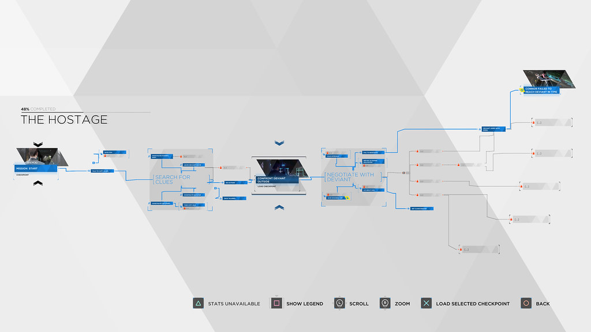
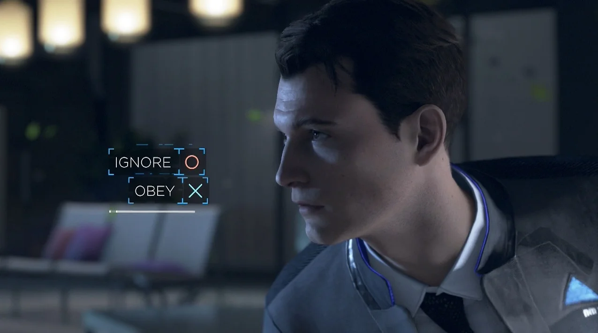

SUPSI 2022-23  
Corso d’interaction design, CV427.01  
Docenti: A. Gysin, G. Profeta  

Elaborato 3: Manipolazione  

# Fuga dall'incubo
Autore: Sofia Nunnari  


## Tema affrontato
Nel mio progetto, ho affrontato il tema della progettazione di un sistema di interfaccia interattiva basato sulla computer vision. L'obiettivo era creare un mini videogioco web a scelte multiple con un'ambientazione horror/thriller, in cui gli utenti potessero interagire utilizzando i movimenti delle proprie mani. Il mio obiettivo era sviluppare un mini videogioco web a scelte multiple con un'atmosfera horror/thriller.


## Riferimenti progettuali
Mi sono ispirato ai giochi di scelta multipla, come "Detroit: Become Human", per la struttura narrativa del mio progetto. Ho cercato di creare un'esperienza interattiva in cui le decisioni dell'utente influenzano il percorso e l'esito della storia.

[]()
[]()


## Design dell’interfraccia e modalià di interazione
Durante lo sviluppo del mio progetto, ho dedicato grande attenzione al design dell'interfaccia e alle modalità di interazione. Ho progettato un'interfaccia utente intuitiva basata su una pagina web, utilizzando JavaScript, HTML e CSS. L'obiettivo principale era garantire un'esperienza di interazione coinvolgente e fluida per gli utenti.

Dopo aver attivato la camera del computer, gli utenti possono interagire con il sistema utilizzando i movimenti e i gesti delle proprie mani. Una caratteristica chiave del gioco è la necessità di posizionare la mano all'interno di un cerchio per confermare le scelte e procedere nella storia. All'inizio del gioco, viene presentato un blocco di testo animato che spiega questa meccanica di interazione agli utenti.

Per implementare questa funzionalità, ho utilizzato JavaScript insieme a librerie come Mediapipe e p5.js. Mediapipe è stata impiegata per il riconoscimento e il tracciamento dei movimenti delle mani attraverso la camera del computer, mentre p5.js mi ha consentito di creare un'interfaccia visivamente accattivante e di animare il gioco.
Per gestire le diverse scelte e i possibili risultati nel gioco, ho utilizzato la libreria Xstate che mi ha permesso di creare una macchina a stati che mi ha aiutato per la gestione degli stati, delle dinamiche narrative e delle interazioni basate sulle scelte degli utenti.

Inoltre, ho adottato una strategia di design che prevede il cambiamento dell'immagine di sfondo e il caricamento di nuovo testo narrativo per segnalare il progresso nel gioco. Questo aiuta gli utenti a comprendere visivamente che stanno avanzando nella storia mentre interagiscono con l'interfaccia.

L'obiettivo del design dell'interfaccia e delle modalità di interazione era offrire agli utenti un'esperienza coinvolgente e intuitiva, dove l'utilizzo delle mani e l'interazione con gli elementi visivi dell'interfaccia giocano un ruolo centrale.


https://github.com/Sofinari/Fuga-dall-incubo/assets/126773941/8b81f19e-cf25-4c82-aa0f-92382acd5917


## Tecnologia usata
Per la realizzazione del mio progetto, ho utilizzato diverse tecnologie. Ho sfruttato JavaScript come linguaggio di programmazione principale per la logica del gioco e l'interazione con l'interfaccia. Per gestire le diverse scelte e gli stati nel gioco, ho impiegato la libreria Xstate, che mi ha permesso di creare una macchina a stati intuitiva e flessibile.

Per quanto riguarda la computer vision, ho utilizzato la libreria Mediapipe. Questa tecnologia mi ha consentito di riconoscere e tracciare i movimenti delle mani dell'utente attraverso la camera del computer. Infine, per la grafica e l'interfaccia utente, ho utilizzato la libreria p5.js. Questa libreria mi ha permesso di creare elementi visivi interattivi e di animare il gioco. p5.js offre una vasta gamma di funzionalità per la manipolazione grafica, che ho sfruttato per creare un'esperienza coinvolgente e visivamente accattivante per gli utenti.
L'utilizzo combinato di JavaScript, Xstate, Mediapipe e p5.js ha reso possibile la realizzazione del mio progetto, consentendomi di creare un'interfaccia interattiva basata sulla computer vision, in cui gli utenti possono manipolare il sistema attraverso i movimenti delle proprie mani.


```JavaScript
if (hands.length == 2) {
                fill("purple");
            } else {
                if (handedness === "Left") {
                    fill("blue");
                    selectedHand = hand;
                } else if (handedness === "Right") {
                    fill("yellow");
                    selectedHand = hand;
                }
            }
```
Riconoscimento delle mani


```JavaScript
function typeWriter(text, element) {
    element.innerHTML = ""; // Cancella il contenuto dell'elemento prima di digitare
    let i = 0;
    const speed = 5;

    function type() {
        if (i < text.length) {
            element.innerHTML += text.charAt(i);
            i++;
            setTimeout(type, speed);
        }
    }
    type();
}

```
Funzione per la scrittura automatica dei testi


```JavaScript
    body.style.backgroundImage = 'url(IMG/' + currentState +'.png)';
    console.log("Percorso immagine:", "IMG/" + state + ".png");

```
Funzione per il cambio di sfondo


```JavaScript
   
const machine = createMachine({
    id: "Gioco",
    initial: "Start",
    states: {
        "Start": {
            entry: " Benvenuto nel gioco! Metti la mano destra all'interno del cerchio (per 3 secondi) per incominciare a giocare!",
            on: {
                destra: {
                    target: "Inizio"
                }
            }
        },

        "Inizio": {
            entry: " Franco notò che ...",
            on: {
                destra: {
                    target: "Porta"
                },
                sinistra: {
                    target: "Muori"
                }
            }
        },
//resto degli stati...
	    },
    predictableActionArguments: true,
    preserveActionOrder: true
});

    

```
Funzione per il cambio di sfondo


## Target e contesto d’uso
Il mio progetto è stato pensato per gli amanti dei videogiochi che desiderano vivere un'esperienza coinvolgente in un contesto horror/thriller. Il sito web è progettato per essere fruibile su dispositivi desktop o laptop, consentendo agli utenti di utilizzare la camera del computer e i movimenti delle mani per interagire con il gioco. L'obiettivo è offrire un'esperienza immersiva e emozionante, in cui le decisioni dell'utente influenzano il percorso e l'esito della storia.


## Link al progetto su GitHub
<a href ="https://github.com/Sofinari/Fuga-dall-incubo">https://github.com/Sofinari/Fuga-dall-incubo</a>
